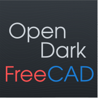
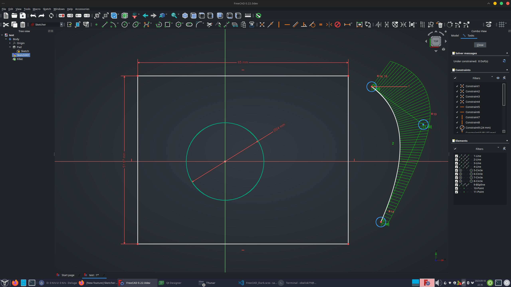
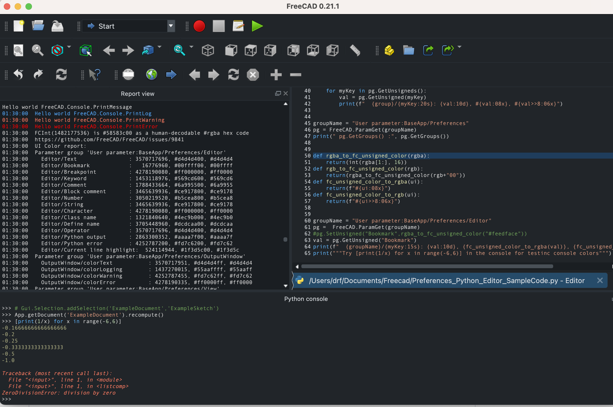
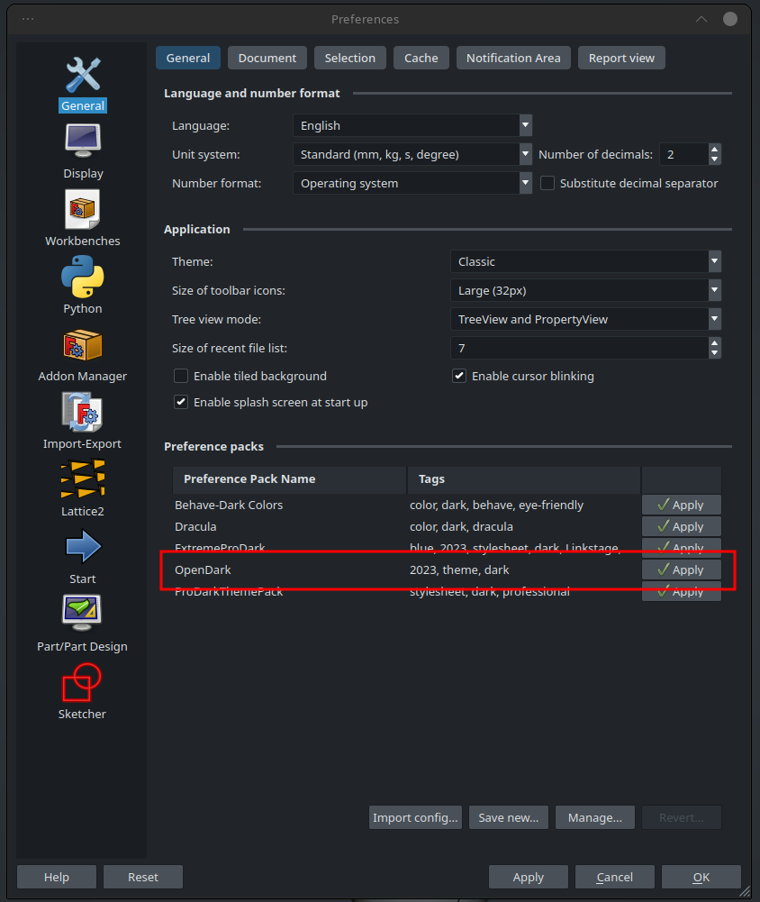

# OpenDark

# PLEASE REPORT ANY ISSUES DISCOVERED ON GITHUB

OpenDark Theme Preference Pack for [FreeCAD](https://www.freecad.org)

This is an color-impaired accessible aesthetically pleasing theme for FreeCAD based on the [Open-Color Palette](https://github.com/yeun/open-color) that is WCAG/APCA compliant.

## Installation

Using [Preference Packs](https://wiki.freecad.org/Preference_Packs) requires FreeCAD 0.20 or higher.

Preference Packs should be installed via the [Addon Manager](https://github.com/FreeCAD/FreeCAD-addons), but can be [installed manually](https://wiki.freecad.org/Preference_Packs#Distributing_a_pack) if required.

## Screenshots

## License
 [LGPLv2](https://en.m.wikipedia.org/wiki/GNU_Lesser_General_Public_License)
