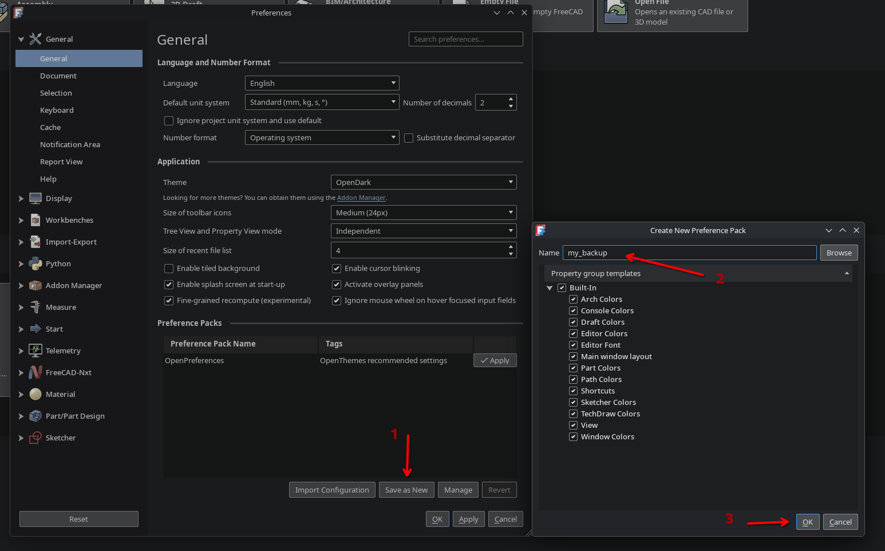
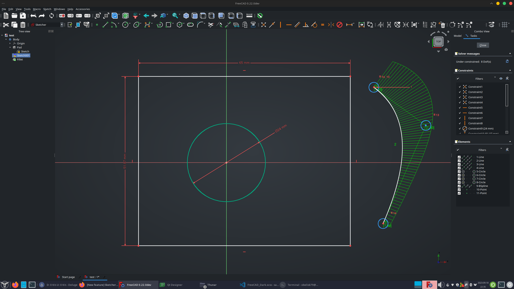
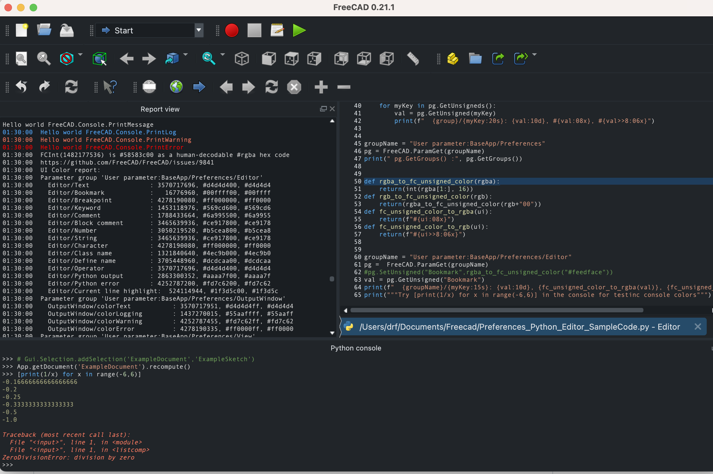

Consider supporting me on [KO-FI](https://ko-fi.com/obelisk79)
# PLEASE REPORT BUGS/PROBLEMS ON [GITHUB](https://github.com/obelisk79/OpenTheme/issues)

Accessible Stylish Themes for [FreeCAD](https://www.freecad.org)

This is a set of light and dark color-impaired accessible aesthetically pleasing themes (OpenLight and OpenDark) for FreeCAD based on the [Open-Color Palette](https://github.com/yeun/open-color) that is WCAG/APCA compliant.

## Installation
These themes should be installed via the [Addon Manager](https://github.com/FreeCAD/FreeCAD-addons).

The themes style FreeCAD. If you want recommended settings, and UI layout apply the OpenPreferences pack.
#### APPLYING A PREFERENCE PACK IS A ONE-WAY PROCESS. Consider backing up your [user.cfg](https://wiki.freecad.org/Start_up_and_Configuration#Configuration_set) file before applying. 

#### ...or by saving your existing settings in a new preference pack.

## Screenshots

## License
 [LGPLv2](https://en.m.wikipedia.org/wiki/GNU_Lesser_General_Public_License)
