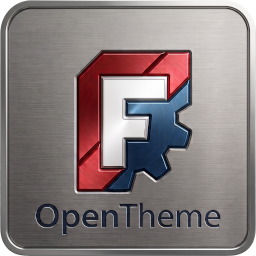

Consider supporting me on [KO-FI](https://ko-fi.com/obelisk79)
# PLEASE REPORT BUGS/PROBLEMS ON [GITHUB](https://github.com/obelisk79/OpenTheme/issues)

Accessible Stylish Themes for [FreeCAD](https://www.freecad.org)

This is a set of light and dark color-impaired accessible aesthetically pleasing themes (OpenLight and OpenDark) for FreeCAD based on the [Open-Color Palette](https://github.com/yeun/open-color) that is WCAG/APCA compliant.

## Installation
These themes should be installed via the [Addon Manager](https://github.com/FreeCAD/FreeCAD-addons).

The themes style FreeCAD. If you want recommended settings, and UI layout apply the OpenPreferences pack.
#### APPLYING A PREFERENCE PACK IS A ONE-WAY PROCESS. Consider backing up your [user.cfg](https://wiki.freecad.org/Start_up_and_Configuration#Configuration_set) file before applying. 

#### ...or by saving your existing settings in a new preference pack.

## Screenshots

## How the themes are built

Requires a FreeCAD version with style parameters (theme tokens in `.yaml` files). For older versions use the `OpenTheme_Legacy` branch.

- The stylesheets contain no colours. They use role tokens such as `@TextPrimary` and `@SurfaceBase`, and FreeCAD fills them in from the active pack's `parameters/<Pack>.yaml`.
- Every pack uses one stylesheet, `OpenTheme.qss`, and one overlay stylesheet. Both live in the `OpenDark` folder with the images (`opentheme_images`), so that pack must stay installed and visible. Every other pack holds only a `.yaml` and a `.cfg`.
- Images come in sets, `<name>_ondark.svg`, `<name>_onlight.svg` and `<name>_onsystem.svg`. A pack's `IconVariant` token picks the set.
- Each theme is defined by a plain text file in `tools/themes/`. `./build.sh` compiles the stylesheets with qtsass and runs `tools/make_themes.py`, which writes every pack's `.yaml` and `.cfg` and the pack list in `package.xml`.
- `OpenDark` and `OpenLight` are built from ten seed colours; every other colour is a blend of those. Their `.cfg` files are hand-made and are the starting point for other themes' 3D view, Sketcher and editor colours.
- `OpenSystem` takes its widget colours from the desktop (Qt `palette(...)` colours). It uses the neutral `_onsystem` glyphs, regenerated with `python3 tools/make_system_glyphs.py .`, and sets a mid-grey 3D view that suits a light or dark desktop.
- `python3 tools/make_themes.py --check` lists stylesheet tokens with no role and contrast pairs below WCAG minimums.
- To add a role, define it in `scss/_tokens.scss` and in `ROLE_GROUPS` in `tools/make_themes.py`.
- `tools/themes-saved/` holds seed-based definitions for other palettes (Catppuccin, Nord, Dracula and more). Move one into `tools/themes/` and rebuild to enable it.

## Making your own theme

Every theme is a plain text file in `tools/themes/`, one colour per line (`Name = colour`). Copy one, rename it,
change the colours, then run `python3 tools/make_themes.py`. `tools/themes/README.md` explains each entry.

## License
 [LGPLv2](https://en.m.wikipedia.org/wiki/GNU_Lesser_General_Public_License)
